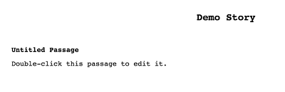
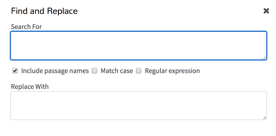

# Using the Editor: Passages View

### Passages View

At the bottom of the Passages View is a menu with access to different functionality.

---

#### Return to Story Listing

Return to the Story List.

---

#### Story Menu

The Story Menu gives access to different functionality about the story itself.

---

##### Edit Story JavaScript

The Edit Story JavaScript screen allows for adding or changing JavaScript code that will be included in the story when run or published in a HTML file.

---

##### Edit Story Stylesheet

The Edit Story Stylesheet screen allows for adding or changing CSS rules that will be included in the story when run or published in a HTML file.

---

##### Change Story Format

The Story Format screens allows for changing the story format in use when running and publishing the story in HTML.

---

##### Rename Story

The Rename Story option allows for changing the name of the story.

---

##### Select All Passages

The Select All Passages places all passages into a single selection for moving or rearranging them as a group

---

##### Snap to Grid

The Snap to Grid option turns off or on if passages should move to the closest grid position when moved.

---

##### Story Statistics

The Story Statistics screen shows data on the story including the number of characters and words.

---

##### View Proofing Copy

The View Proofing Copy of a story is the text of all passages except for the Story JavaScript and Story Stylesheet.

---

##### Publish to File

The Publish to File option compiles the current story and any Story JavaScript and Story Stylesheet code into a single HTML file.

---

#### Quick Find

The Quick Find functionality is used for searching for words or longer phrases across all passages.

---

#### Find and Replace

The Find and Replace functionality search for words, phrases, or certain expresses for the purpose of replacing them, if found, with other words or longer phrases.

---

#### Story Stucture

The Story Structure view shows the connection between passages only.

---

#### Passage Titles

The Passage Tiles view shows simply that: passage titles.

---

#### Titles and Excerpts

The Titles and Excerpts view shows passages, their contents, and excerpts of their contents.

---

#### Play Story in Test Mode

The "Play Story in Text Mode" button starts turns on debugging functionality and starts the story.

---

#### Play Story

The "Play Story" button starts the story in a new tab or window.

---

#### Create New Passage

The "Create New Passage" button creates a new, unconnected passage in the Passage View.
