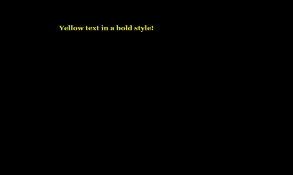
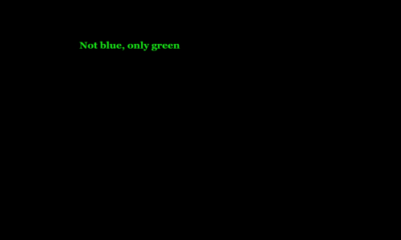

# Harlowe CSS

Harlowe strongly encourages authors to style stories through using [macros](https://twine2.neocities.org/#markup_macro) and named hooks.

---

## Named Hooks

### Page

`?Page`: Affects the `<tw-story>` element.

**Example:**

```twee
(enchant: ?Page, (text-color: yellow) + (text-style:'bold'))
Yellow text in a bold style!
```

**Example Presentation:**



### Passage

`?Passage`: Affects the `<tw-passage>` element), allowing `(text-colour:)`, `(font:)`, or `(css:)` usage with text content.

**Example:**

```twee
(enchant: ?Passage, (text-color: green) + (background: red))
Red background and green text!
```

**Example Presentation:**


### Sidebar

`?Sidebar`: Affects the `<tw-sidebar>` element, allowing macros like `(replace:)` or `(append:)` to change text content.

**Example:**

```twee
(replace: ?Sidebar)[This is the new sidebar content!]

[[Another Passage]]

```

**Example Presentation:**


### Link

`?Link`: Affects all of the links (passage links and `(link:)`) in the passage.

**Example:**

```twee
(enchant: ?Link, (color: green) )

[[Not blue, only green]]
```

**Example Presentation:**



---

## Overwriting Harlowe CSS

!!! Warning
    Overwriting existing CSS rules is an *advanced* technique.
    It has the potential to significantly change the presentation of content.

All Harlowe stories follow the same [HTML structure](../../html/storyformats/harlowe.md#harlowe-html).

### tw-passage

Like working with `?Passage`, using the type selector with `tw-passage` allows for overriding or augmenting the existing declarations.

```css
tw-passage { /* Your CSS Here */ }
```

### tw-link

When creating hyperlinks, Harlowe uses the `<tw-link>` element.

```css
tw-link {/* Your CSS Here */ }
```
