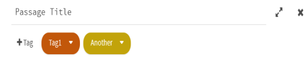
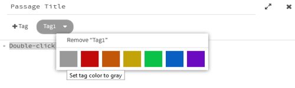
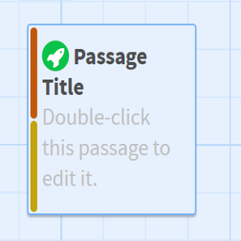

# Passages

Working in Twine is working with passages. They are foundational to how Twine works, and also what is shown to users when they view a Twine story.

A [passage](../terms/terms_passages.md) is a way of thinking about different parts of a story. They can be rooms in a house, different time periods, or compartments for storage. The connections between them are made by the author or as part of the playing experience by the reader.

## Passage Anatomy

Passages are divided into three parts.

### Title

All passages have a title. These are used to connect not only passages together, but, in some story formats, also have special meanings.

(See SugarCube [documentation on Passage Names](https://www.motoslave.net/sugarcube/2/docs/#special-passages).)

### Tags

Passages can optionally have tags. In generally, these can be used by authors to organize content or imply relationships.

In Twine 2, tags can also have colors. When used in this way, the color will be shown on the left-hand side with more colors dividing up the vertical space.

(In Harlowe, [certain tags have special meaning](https://twine2.neocities.org/#passagetag_header). SugarCube [reserves certain tag names](https://www.motoslave.net/sugarcube/2/docs/#special-**tags**).)

### Content

The content of a passage is anything within it. While passages can be thought of as content sections, they are also where code goes to change how text appears and how the passage should respond to the user. Writing prose and code both happen within passages. They are not separated in Twine: writing in a passage has the potential to be either or both at the same time.

## Links

Generally, the action of clicking a [link](../terms/terms_passages.md#connecting-passages) in Twine is a movement between passages. In interactive fiction terminology, this can be thought of as a *turn*. The act of clicking the link signaled that a choice was made and it is now time to progress to the next content or set of choices.
