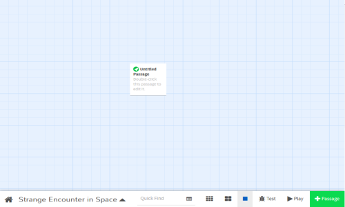
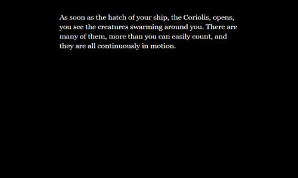
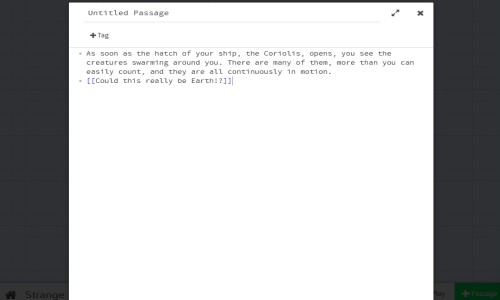
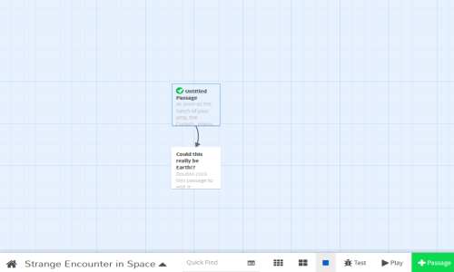
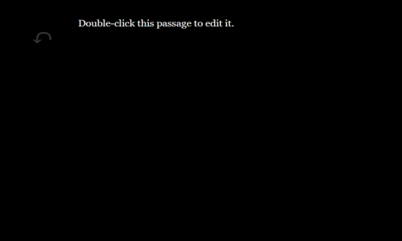
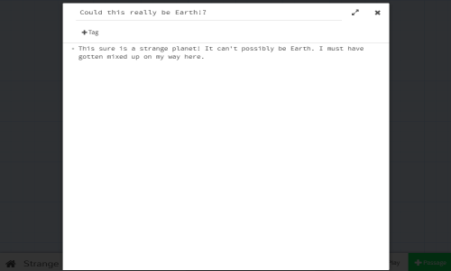
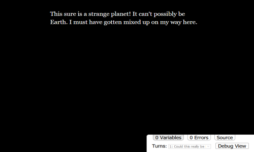

# Twine 2: How to Create Your First Story

!!! Information
    Before you create your first story using Twine 2, please consult the [Where are my stories saved?](../../questions/stories_saved.md) page.

---

## Starting with a Story

Many Twine 2 projects begin with a story idea. For this example, the story idea will be that the player is an astronaut exploring the galaxy. They will encounter a planet like Earth, but with strange creatures instead of humans!

When starting Twine 2, either the online or desktop version, it opens with the [Story Listing](../../introduction/twine2_story_listing.md). This is where all stories are stored and can be accessed.


To create a new story, click on the "+Story" button on the right-hand sidebar. This will ask for a story title. Name this story `Strange Encounter in Space` and click on the "+Add" button.


The new story is now added to the list and the [Passages View](../../introduction/twine2_passages_view.md) is opened automatically!

---

## Editing Passages



The first passage added in Twine 2 is called "Untitled Passage". It will be positioned in the middle of the screen. Double-clicking (or tapping, on mobile) will open the passage for editing.

Passages have names, optional tags, and content. By default, a passage will have the content of `Double-click this passage to edit it.`


Change the content to the following:

```twee
As soon as the hatch of your ship, the Coriolis, opens, you see the creatures swarming around you. There are many of them, more than you can easily count, and they are all continuously in motion.
```


Close the passage editor either with the Escape key, or by clicking or
tapping the `X` in the upper-right corner. Twine 2 automatically saves the passage when you close it!

---

## Playing a Story

With the passage closed, it's now time to play it!

The bottom menu in the Passage View is the Story Menu. It allows for changing details about the story, navigating back to the Story Listing, and, for right now, playing a story.

Click on the "Play" button in the bottom, right-hand corner.

Twine 2 will the open up the story as a HTML file in a web browser.



### Playing with Online Twine 2

When using the online version, the story will open in a new tab.

> **Note:** The URL in the online version of Twine 2 will look something like the following:
`https://twinery.org/2/#!/stories/2f3e4f18-2bde-4213-b29b-08a1e368804c/play`.
>
> **This is not a URL to access the story!** The number part of the URL is a key to the local storage of the browser only.

The story can be played and the new tab safely closed when done. (For continuing to edit, leave the tab open and Twine 2 will refresh it when the "Play" button is clicked again.)

### Playing with Desktop Twine 2

When using the desktop version, Twine 2 will open a HTML stored in the temporary files of the operating system and in whatever the default web browser is for the system is.

Unlike the online version, the desktop version of Twine 2 *will create a new file every time the "Play" button is clicked.*

---

## Connecting Passages

Return to the Passages View.

Double-click (or tap, on mobile) the "Untitled Passage" again.

This time, add the following at the bottom:

```twee
[[Could this really be Earth!?]]
```



In the background of editing the passage, Twine 2 will create a new passage called "Could this really be Earth!?".

> **Note:** The above use of double opening and closing square brackets is a [passage link](../../terms/terms_passages.md). In Twine 2, links connect passages.

Close the passage editor either with the Escape key, or by clicking or
tapping the `X` in the upper-right corner.

There are now two passages! The first is "Untitled Passage" and the second is "Could this really be Earth!?".



Clicking and dragging either passage shows that they are connected. They are "linked!"

---

## Play it Again

Click on the "Play" button again.

In either a new tab or the existing play tab (depending on version or if closed previously), the story will update.

A new link is added to the text that reads "Could this really be Earth!?".


Passage links are not just connections between them, they are also *hyperlinks* between passages in a story.

Clicking on the story will load a new passage. However, this passage, "Could this really be Earth!?", still has the default text of "Double-click this passage to edit it."



Return to the Passage View and double-click (or tap, on mobile) the "Could this really be Earth!?" passage.

Change its contents to the following:

```twee
This sure is a strange planet! It can't possibly be Earth. I must have gotten mixed up on my way here.
```



Close the passage editor either with the Escape key, or by clicking or
tapping the `X` in the upper-right corner.

---

## Testing a Passage

This time, instead of clicking on "Play", place the cursor over the passage in the Passage View.


A new menu will appear with icons. Click on the triangle ("Test story starting here") button.

Instead of beginning with the original passage, the story will start in the **Debug mode** and begin the story at the new passage.



This is a very useful way to test individual passages and see their contents instead of having to navigate through a story.

---

## Testing a Story

Go back to the Passages View.

In the lower, right-hand corner, click on the "Test" button.


Like with testing from a single passage, this will open the story in **Debug mode**. This will open the story from the starting passage.

---

## Congratulations

Using Twine 2 follows the patterns outlined in this page:

- Starting with a story idea
- Adding passages and links
- Playing stories to experience it as a reader
- Testing both individual passages and the story as a whole
