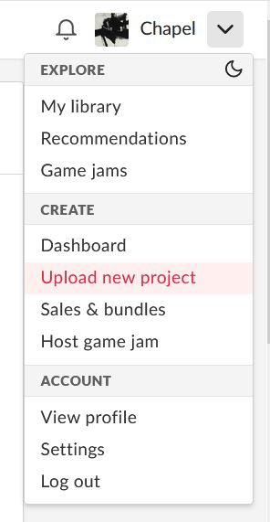
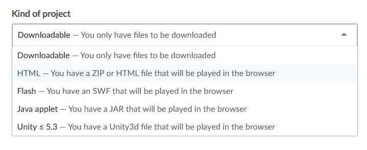
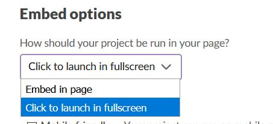
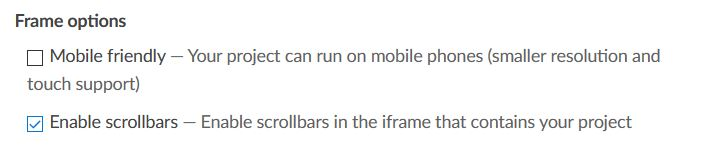
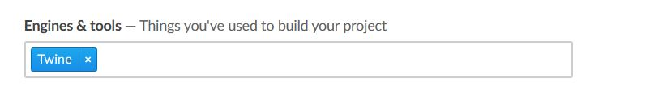
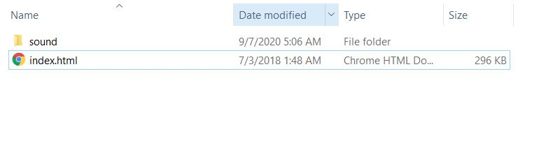
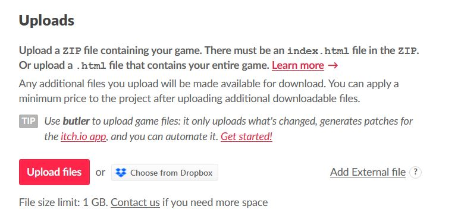
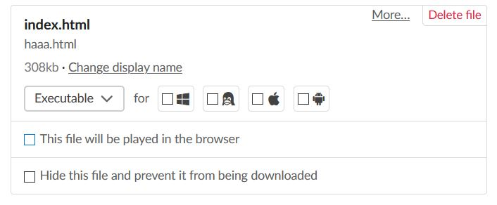
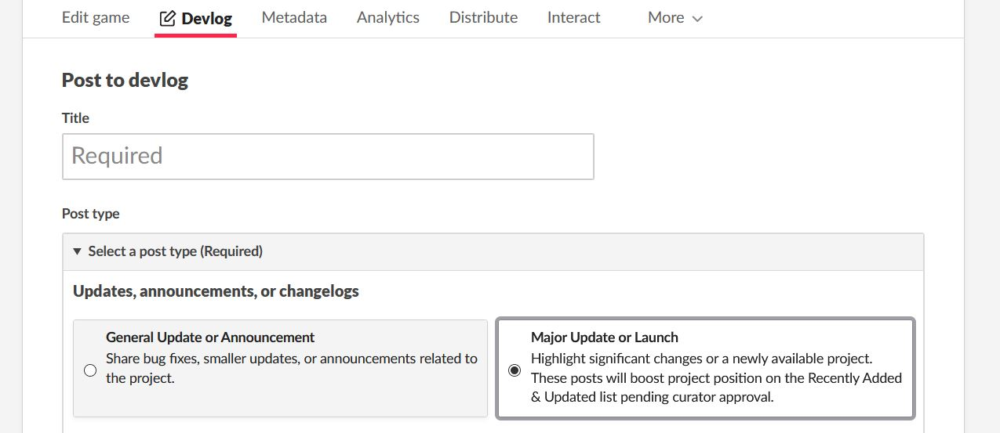

# Publishing Twine Games on Itch.io

[Itch.io](https://itch.io) is an online independent gaming marketplace that can be used to easily host Twine games for free. This guide will detail the process of uploading a Twine game to the site.

## Step 1: Create an Account

Create an account on Itch.io, if one does not exist already. (GitHub accounts can also be used to login to Itch.io.)

In `Settings > Profile`, click the `Developing and uploading games` box.

## Step 2: Create a New Project

Open the menu next to the username and click `Upload new project`.

Use the form to fill out details on the project.

Because Twine uses HTML, be sure to set the `Kind of project` to `HTML`.

Change the `Embed options` to `Click to launch in fullscreen`.

**Note:** The embed option can be confusing. The project will not open in fullscreen. Instead, it will open in the full browser window or tab instead of being embedded in the page. For best display results, this is recommend for most Twine projects.

For `Frame options`, check `Enable scrollbars` box; by default it is **not** checked:

**Note:** Whether the game is mobile-friendly is based on the story format used, its version, and the game's code itself. If left unchecked, users on mobile phones or tablets will be warned that the game was not designed for their device, but they will still be able to try to play the project.

Under the `Metadata` tab in the `Engine & Tools` section:

Twine is selectable as an engine.

## Step 3: Uploading Project Files

If using a single HTML file, it can be uploaded by itself. If the project contains multiple files such as images, audio files, or other assets, these should be packaged into a single ZIP file before uploading.

**Note:** If using multiple assets, make sure the HTML file is named `index.html`.

Upload either an HTML or a ZIP file.

To allow the file to be played right in the browser, check the box `This file will be played in the browser`:

## Bonus Step: Major Updates

To update a previous upload or existing project, create a devlog entry with the `major update or launch` post type:

These devlogs are reviewed by the curators at Itch.io. If the update is considered significant enough, the game's visibility could be significantly boosted for a while, similar to if it were new.

Anyone following the creator or project will also be notified of the update.
