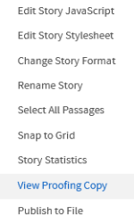
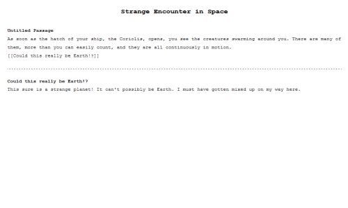

# Reviewing Stories

Twine does more than simply play and publish files. It also provide functionality to produce *proofreading* versions of stories.

## Proofing Copy

When in the Passages View, the Story Menu can be accessed for that story.

Clicking on the [View Proofing Copy](../../introduction/twine2_passages_view.md#view-proofing-copy) option opens the currently selected Proofing Format.

Like with testing or playing a story, this will open in a new tab.

> **Note:** By default, the proofing format used is Paperthin. This shows the text contents of all passages but does not include the Story JavaScript or Story Stylesheet content.

## Using Proofing Copies

Proofing copies are designed, as their name implies, for *proofreading*. For larger, potentially complex stories, often the text content needs to be reviewed or adjusted outside of editing the individual passages within the story.

Proofing formats allow an author to produce something that includes only the text of the story itself. This could then be passed to an editor or other people.
